# Sw_CSharp 宏程序

本文将介绍用 CSharp 编译 dll 宏程序的操作方法。

注意：dll 宏在 SW2019 后才支持，之前的版本就还是用 swp（VBA格式）

## 新建 SW 宏

打开 SW 在【工具-宏-新建宏】，新建空白的宏程序，保存格式选择.csproj,以下就是 dll 宏的文件结构。其中 Macro.csproj 是C#项目文件，后面会操作在C#新建空白模板来添加使用。

```
Macro
	|—— bin
	|—— obj
	|——	Properties
	|—— Resource
	|—— Macro.csproj
```

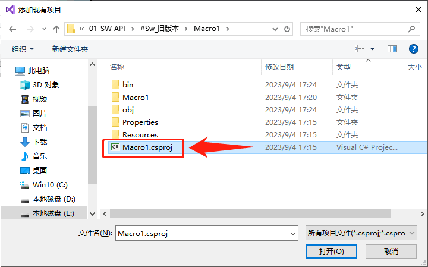

## 新建 C#项目

打开 Visual Studio 工具，创建新项目

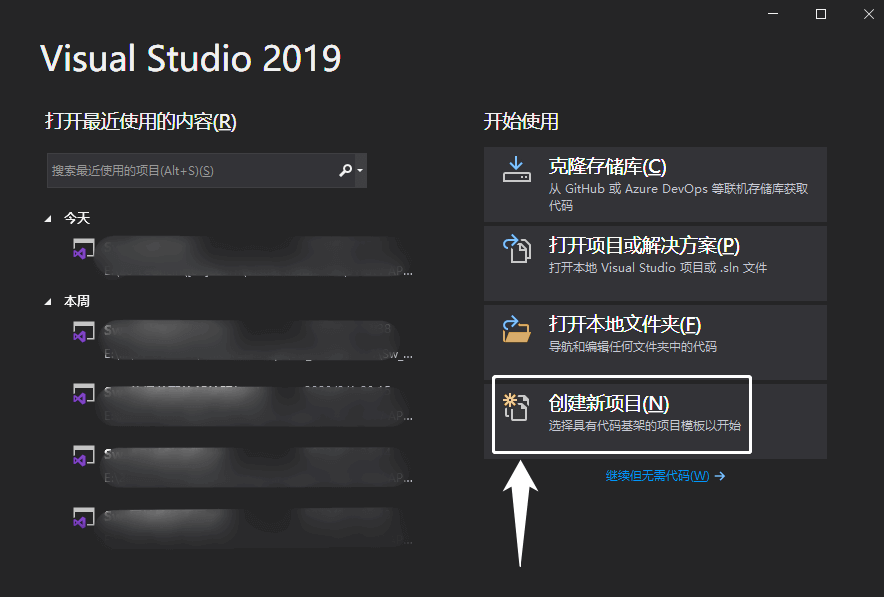

新项目选择空白的解决方案，这里只是同个这个空白项目来打开.Csproj 文件，这个文件就是我们 SW 宏的项目文件

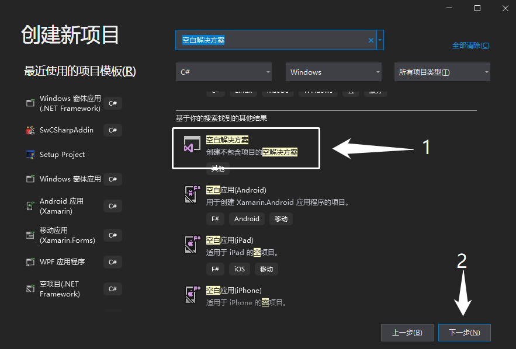

解决方案名字默认即可

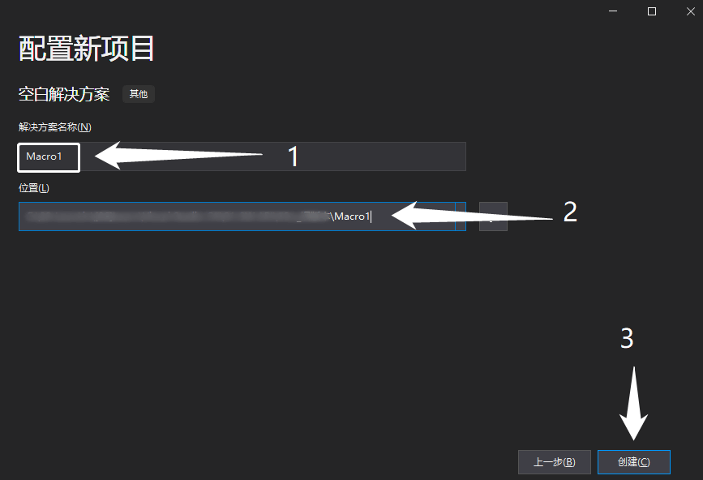

## 添加宏到C#

创建空白解决方案后，在右侧解决方案资源管理器内【右键解决方案-添加-现有项目】

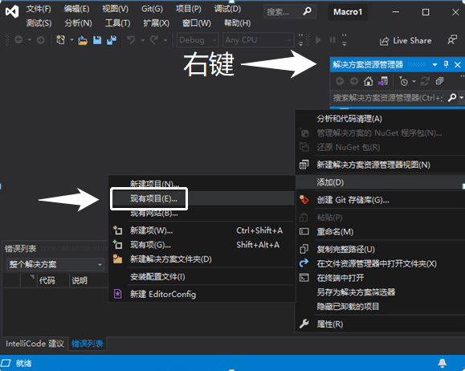

添加选择我们从 SW 新建保存出来的.csproj 文件


打开后，资源管理器内显示的就是 SW 宏项目的完整结构了。主要是函数内容写在"SolidWorksMacro.cs"里面即可

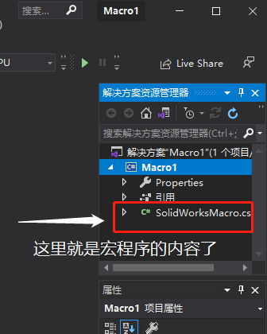

双击打开"SolidWorksMacro.cs"在 Main()里面就是主函数内容了。

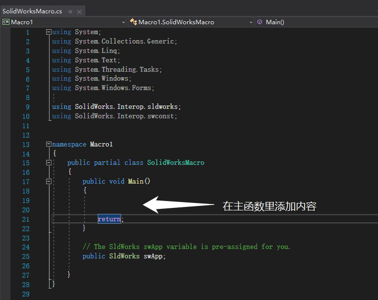

稍微下个程序试试

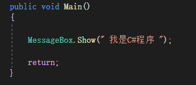

# 使用

## 自定义宏命令

在 SW 软件空白工具栏里【右键=自定义】

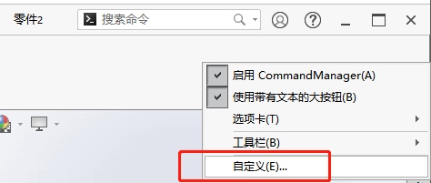

在自定义窗口中，找到【命令菜单-宏-新建宏按钮】，并将其拖放至工具栏空白处

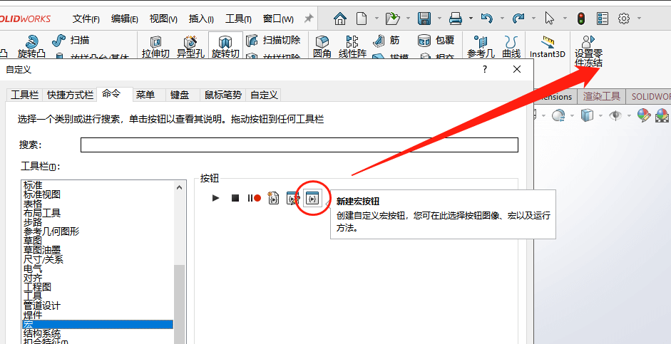

自定义宏按钮需要我们选择宏程序（.swp 或.dll 格式）

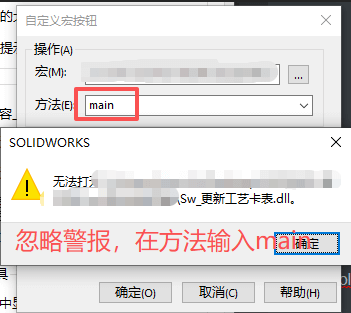

我们浏览找到通过 CSharp 编译生成的 dll 宏程序，因为这里的程序是C#写的dll格式的文件，所需的程序库是外部加载的。你可能需要额外准备好下面两个文件，并将其于宏程序放在同一文件夹内。

- SolidWorks.Interop.sldworks
- SolidWorks.Interop.swconst

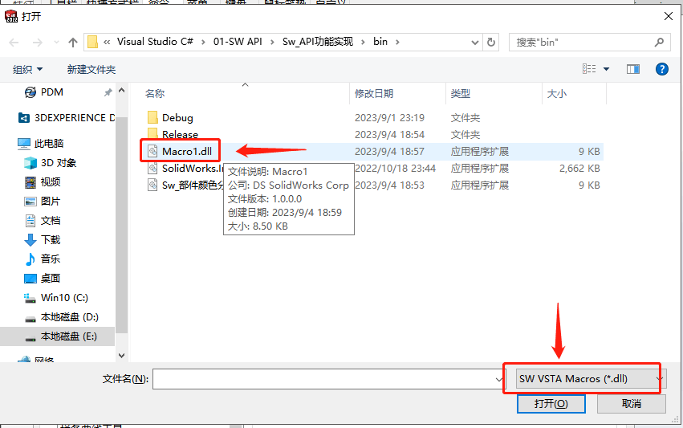

自定义宏按钮里的方法默认会自己选择"Main()"函数，当然这里我们也是可以手动输入的。


完成自定义宏按钮后，我们点击它。程序如愿执行弹窗效果。功能可行。

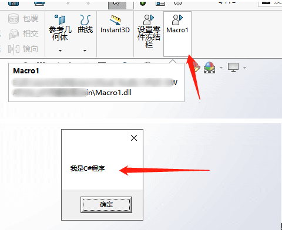

# Q&A

Q：自定义宏运行没反应？

A：有一种情况是外部库SolidWorks.Interop.sldworks.dll没有放一起。

Q：无指定宏程序？

A：如果方法名里显示空白则可能会出现”无指定宏程序“的提示，并无法添加宏命令。当然这里我们也是可以手动输入"Main()"函数的。


