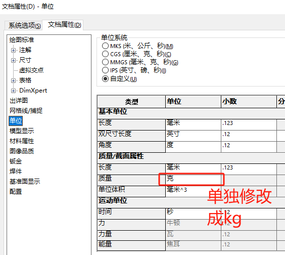

# SOLIDWORKS-API修改单位

文档属性我们是使用如下方法进行修改，

```
'用SetUserPreferenceInteger()方法，来调整设置【文档属性】设置
```


## 关键方法

```vb
Dim swApp As SldWorks.SldWorks
Dim swModel As SldWorks.ModelDoc2
Set swApp = Application.SldWorks
Set swModel = swApp.ActiveDoc

'设置单位标准'设置为MMGS
swModel.Extension.SetUserPreferenceInteger(swUserPreferenceIntegerValue_e.swUnitSystem, 0, swUnitSystem_e.swUnitSystem_MMGS)

swModel.Save
swModel.Close

End Sub
```

# 更新

## 20241104

增减单独修改质量单位的操作，



```vb
'设置质量单位
'Unit = swUnitsMassPropMass_e.swUnitsMassPropMass_Milligrams '设置mg
'Unit = swUnitsMassPropMass_e.swUnitsMassPropMass_Grams '设置g
Unit = swUnitsMassPropMass_e.swUnitsMassPropMass_Kilograms '设置kg
'Unit = swUnitsMassPropMass_e.swUnitsMassPropMass_Pounds '设置磅

swModel.Extension.SetUserPreferenceInteger(swUserPreferenceIntegerValue_e.swUnitsMassPropMass, 0, Unit)
```


