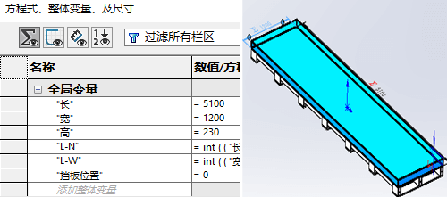
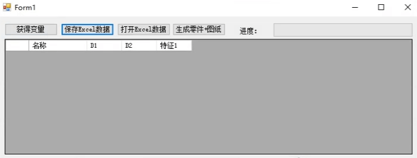
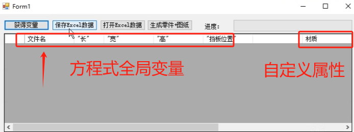

# SW_参数化工具

利用模板零件进行表格批量设计的工具

首先你需要准备好带有方程式（全局变量）的模型：

# 功能

## 获得变量

获得零件模型的方程式“全局变量”和“自定义属性”

## 保存excel

将前面获得的数据进行表格保存

## 打开excel

打开编辑好"尺寸参数"和"属性"的表格，用于【生成零件+图纸】使用

## 生成零件+图纸

这个功能会将零件设计参数进行修改，并且打包零件+工程图。如果是已经存在的同名零件，则会将其删除，新生成一份文件。

# 日志：

## 20241139：

增加自定义属性的操作

