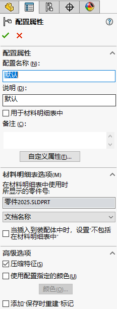

# Sw_修改配置属性




```

Part.EditConfiguration3("默认", "默认", "", "", 548)
```


# 参考

https://help.solidworks.com/2018/english/api/sldworksapi/solidworks.interop.sldworks~solidworks.interop.sldworks.imodeldoc2~editconfiguration3.html