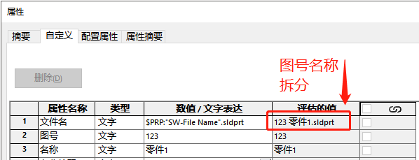
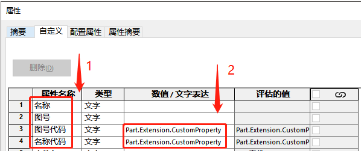
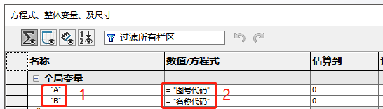
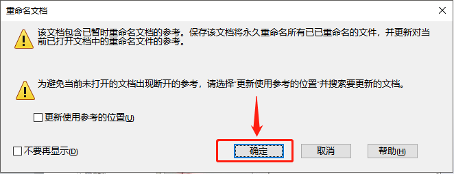

---

title: Sw 图号名称分离工具
tag: SOLIDWORKS
toc: true
---

# Sw_图号名称分离工具

我们设计文件通常会以"12345+零部件名称"的图号+名称的形式，并且我们希望此文件名的图号和名称能以单独的属性填入，如图



<!--more-->

利用方程式实现图号名称自动分离，需要用到方程式作为属性代码的变量，属性项里填入操作的代码。实现对文件名分离。演示模型如下：

零件 [0001 图号名称分离.SLDPRT](Sw_图号名称分离工具-A\0001 图号名称分离.SLDPRT) 

装配体 [0001 图号名称分离.SLDASM](Sw_图号名称分离工具-A\0001 图号名称分离.SLDASM) 

步骤如下：

## 1填入代码属性

点击文件-属性，在属性栏增加这 4 项



在图号代码和名称代码数值里填入如下内容，需区分零件和装配体的格式。

**1-1 零件**

零件图号代码：

```
Part.Extension.CustomPropertyManager("").Set("图号",Left(Part.GetTitle,InStr(Part.GetTitle," ")))
```

零件名称代码：

```
Part.Extension.CustomPropertyManager("").Set("名称",Trim(Replace(Right(Part.GetTitle,Len(Part.GetTitle)-InStr(Part.GetTitle," ")),".SLDPRT"," ")))
```

**1-2 装配体代码**

装配体图号代码：

```
Assembly.Extension.CustomPropertyManager("").Set("图号",Left(Assembly.GetTitle,InStr(Assembly.GetTitle," ")))
```

装配体名称代码：

```
Assembly.Extension.CustomPropertyManager("").Set("名称",Trim(Replace(Right(Assembly.GetTitle,Len(Assembly.GetTitle)-InStr(Assembly.GetTitle," ")),".SLDASM","")))
```

## 2填入方程式变量

点击【工具-方程式】，按照图片内容增加 2 条方程式（引号为英文状态双引号）



## 3完成

按需要修改文件名，以空格作为图号名称分割的判断。

# 问题点：

每次打开，不管你改没改文件，都会弹出保存对话框，打印图纸也提示保存。并且在外面修改的名称需要打开文件保存属性修改才能生效。针对问题做了如下测试：

1.  在 SW 软件外改名，属性无更新，需打开文件保存生效；

2.  在 SW 软件内改名，属性更新，保存生效；

3.  装配体打包零件改名，属性无更新，打开装配体（保存所有）或零件保存后生效；

期间出现"参考文件提示"选择确定



# 其他

## 属性代码：

零件：

```
图号
Part.Extension.CustomPropertyManager("").Set("图号",Rtrim(Left(Part.GetTitle,InStr(Part.GetTitle," "))))
名称
Part.Extension.CustomPropertyManager("").Set("名称",Trim(Replace(Right(Part.GetTitle,Len(Part.GetTitle)-InStr(Part.GetTitle," ")),".SLDPRT"," ")))
```

装配体：

```
图号
Assembly.Extension.CustomPropertyManager("").Set("图号",Left(Assembly.GetTitle,InStr(Assembly.GetTitle," ")))
名称
Assembly.Extension.CustomPropertyManager("").Set("名称",Trim(Replace(Right(Assembly.GetTitle,Len(Assembly.GetTitle)-InStr(Assembly.GetTitle," ")),".SLDASM","")))
```

配置特定：以上是识别到自定义属性的代码。若需要按当前配置录入到配置特定的属性。则有如下区别

```
将自定义属性的变量“”
Part.Extension.CustomPropertyManager("")
改成
Part.Extension.CustomPropertyManager("Part.GetActiveConfiguration.name")
```

## 扩展名问题

这里也发现通过其他代码实现的例子，记录下。但这个代码有个问题：文件扩展名需要显示出来，否则名称会分离错误

```
Assembly.Extension.CustomPropertyManager("").Set("名称", Left( Right(Assembly.GetTitle,Len(Assembly.GetTitle)-InStr(Assembly.GetTitle," ") ) ,Len( Right(Assembly.GetTitle,Len(Assembly.GetTitle)-InStr(Assembly.GetTitle," ") ) ) -7 ) )
```
