# Sw 属性编辑工具

用于批量处理 SW 文件属性的工具程序，目前只支持 SW 2019 及以下版本的操作。

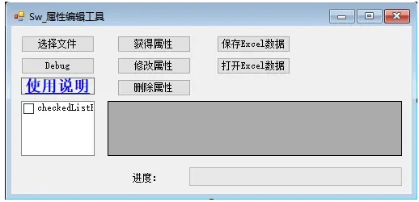

<!--more-->

## 选择文件：

选择需要处理的 SW 文件，包括后缀为".sldprt，.sldasm，.slddrw"等文件格式。

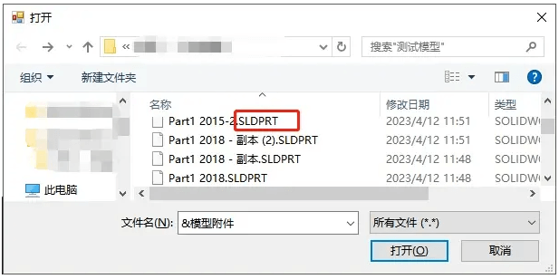

## 获得属性：

获得属性可以通过左侧的复选框，选择需要处理的属性名。如果默认不做选择的话，则是输出全部的属性。

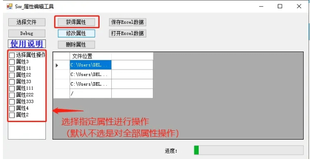

默认全部属性

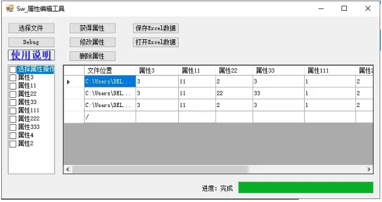

选择部分属性

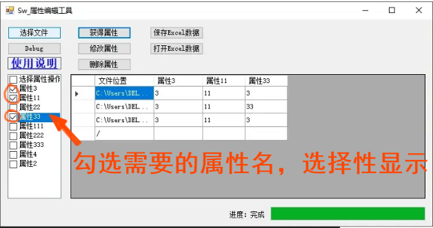

## 修改属性：

根据表格所显示的内容，对处理文件的属性名和属性值进行修改。批量修改小技巧：你可以全选表格粘贴到 Excel 进行刷格式的修改。

注意：默认空值是不输入的，需要输入空值，你可以在属性值一栏填<空格>表示

## 删除属性：

同获得属性操作类似，你可以通过左侧的复选框，选择需要删除的属性名。如果默认不做选择的话，则是删除全部的属性。

## 保存 Excel：

顾名思义，会将【获得属性】的工具表格数据保存到外部

## 打开 Excel：

使用外部出来的表格打开的话，就“不用”选择文件了，因为表格内就包含文件路径和配置。我们只需要表格数据导入到工具内使用即可

Excel 目前只支持 2007 以下，格式为".xls"的 Excel。高版本的电脑需要安装数据引擎插件，并不是大家所有电脑都会安装。所有就按通用的低版本来

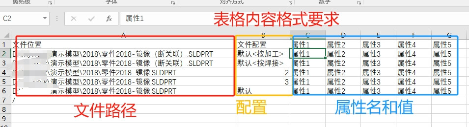

# 更新

## 2023/04/26

更新"获得评估的值"功能，该功能可以得到属性值的结果（原先的获得属性是获得属性的表达式，方便编辑，不便查看）

## 2023/07/01

更新"配置特定"的属性操作。原先操作对象只限于自定义的操作，现在增加到配置特定属性操作。

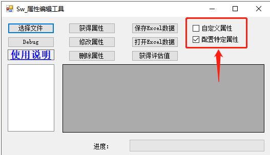

## 2024/01/18

修复【选择文件】不能获得空属性的文件的问题。原先代码是会跳过没有属性的文件导致获取不到操作对象。

## 2024/08/30

增加错误文件的日志记录功能，起因是部分只读和加密文件在导入程序时，会被阻止并且程序退出。

现在改成将错误文件路径填到log日志文本里（并且不会程序退出，而是忽略错误文件继续）

## 2024/11/02

增加数字进度显示，可用知道：进行操作的当前文件数 / 总文件数的值

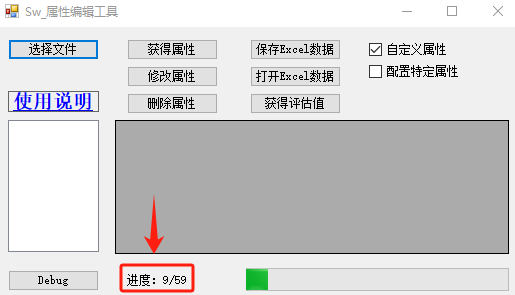


# Q&A

## 没有在表格是数据是否修改

A没有显示的数据是不做处理（保留原样），需要删除，则先进行选择“勾选”该属性【删除属性】操作

## datagridview 不能批量编辑

A1：只能是通过【打开 Excel】功能，导入已批量编辑好的表格文件；

## 不同属性的文件会覆盖属性名列表头

A2：在填入属性名列表头前，做不同文件的属性名整理包括：合并不同文件属性名，再排除重复属性名，再重新排列属性名数组。

## 打开文件操作属性

模板格式的文件（.prtdot.asmdot.drwdot）属性在 SWDocumentManage.dll 是不能操作的，所以需要增加一项打开文件操作属性的程序

## 评估的值不正确

钣金参数引用时，有时遇到需要**打开**，**保存后**才能读取到最新结果

## 类型转换失败

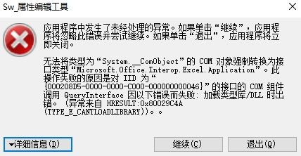

## 未注册Microsoft.ACE.OLEDB.12.0

是【保存excel】功能的问题，原先支持的excel版本是2003-2007的xls格式，需要在微软下载运行库进行安装注册[Download](https://www.microsoft.com/zh-cn/download/details.aspx?id=13255)

还有一种情况生成程序时，使用的目标平台也有选择：按道理现在平台应该大都为x64

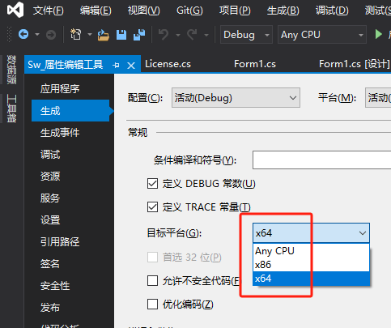


## 未将对象引用设置到对象的实例

请检查：

1、文件版本，目前只支持到2023；

2、文件只读，只读文件是不能被读写的；

3、文件加密，和2类似读写权限被限制了；

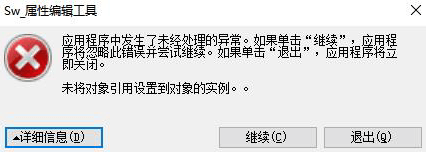

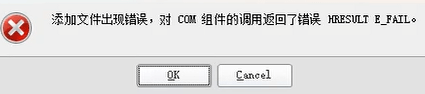

## 无法创建 ActiveX

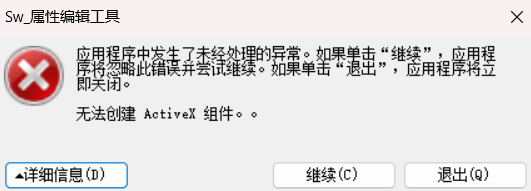

安装2016office可以

## 不是有效名称

已知有属性名或属性值是空格时会出现该情况。

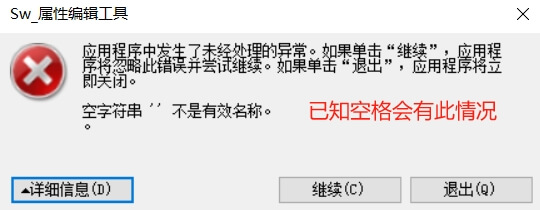

## 低版本文件

目前发现2013版本文件是支持使用该工具的，底层的程序处理不一样，方法不同。识别不了

A目前方式是跳过并作出提示：如下：

```c#
try { configs = configmgr.GetConfigurationNames(); }
catch (Exception) { Error_file += filepath[j] + "\n"; Error_Switch = true; Error_Alert = Error_Alert2; continue; }
```


<!-- 许可

littleboy:

-->
