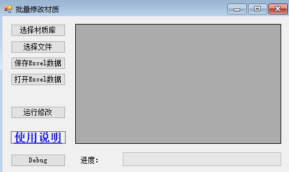
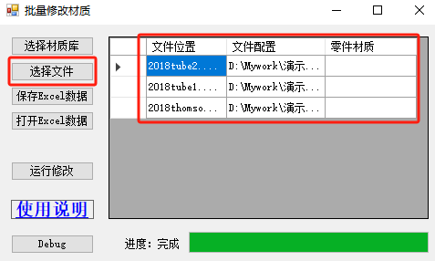

# Sw_批量修改材质

当我们需要对大批零件的材质进行添加修改时，可用考虑使用如下方法。

## 代码

```C#
public static void SetMaterial(string filepath, string sldmat, string meterial)
{
    //打开文件对象
    swApp.OpenDoc(filepath, 1);
    swDoc = (ModelDoc2)swApp.ActiveDoc;
    PartDoc swPart = (PartDoc)swDoc;
    //更换材料(配置，材质库，材料名)
    swPart.SetMaterialPropertyName2(swDoc.GetConfigurationNames()[0], "sldmat", "meterial");
}

```


## 使用

基于代码要求内容：我们稍作修改使其按照批量循环的方式进行处理。便有了如下的窗口：



- 选择材质库：获得sldmat文件路径，便于访问材质库内容；

  ```
  
  ```

- 选择文件：获得处理文件的列表组合，以及表格格式

- 

  ```C#

  ```
  
  

- 保存/打开Excel：将上一步获得的文件路径集合导出到表格处理，再通过打开的方式加载进来。

  

  

- 运行修改：例如处理好的excel数据，进行操作。

  ```C#
  
  ```

  

