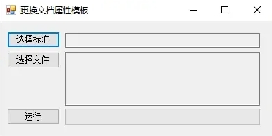
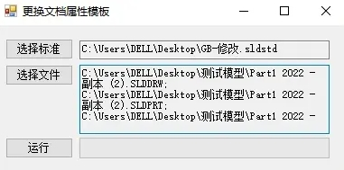

# Sw_更新文档属性

这是一份小工具，用于批量修改文件文档属性模板。主要用在我们需要批量更新文件“绘图标准”（也就是修改文档属性）时使用。



## 使用

1、选择标准：选择你修改好的文档属性文件“xxxx.sldstd”（该文件在【选项-文档属性-标准】选择保存到外部文件获得）


2、选择文件：选择需要更新的零部件（因为零件、装配体、工程图有着不一样的标准文件，建议是分开处理）



3、运行：等待完成即可。

## 代码

```C#
swDoc.Extension.LoadDraftingStandard("绘图标准.sldstd");
```

