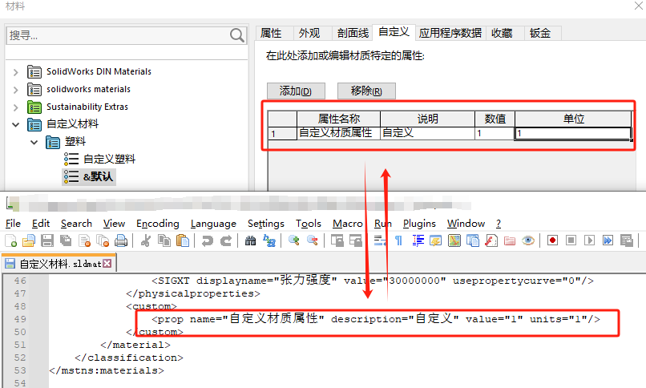
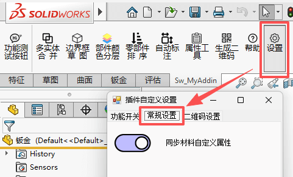
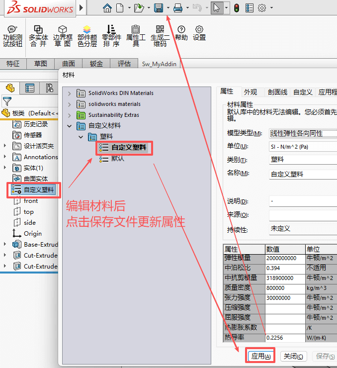
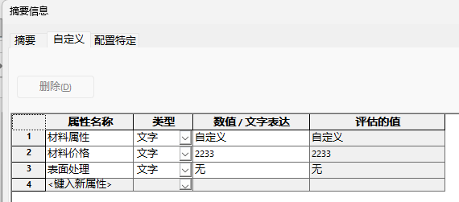

# Sw_材料自定义属性使用

使用**自定义**选项卡将非标准属性添加到材料中。 可使用 API 调用来检索属性。 当所选的材料位于自定义库中时，此标签可进行编辑。

[材料对话框 - 自定义标签](https://help.solidworks.com/2018/chinese-simplified/Solidworks/sldworks/HIDD_DLG_MATEDITTAB_CUSTOM.htm)

<!--more-->


## 代码

通过MaterialIdName获得材料库和材料名，因为获得的结果是“材料库|材料名”。所以可以考虑用string.Split()方法分开。

```c#
//获得当前材料
ModelDoc2 swDoc = swApp.ActiveDoc;
//获得当前材料库
string material_db = swDoc.MaterialIdName.Split('|')[0];
//获得当前材料名
string material_name = swDoc.MaterialIdName.Split('|')[1];
string material_xmlpath = "";
```


Sldwork.GetMaterialDatabases()方法可以获得材料库文件路径集合。

```c#
//获得当前材料库集合
object[] vMatDBarr = (object[])swApp.GetMaterialDatabases();
foreach (object item in vMatDBarr)
{
//通过名称对应，找到材料库的路径并返回 
if (item.ToString().IndexOf(material_db, StringComparison.OrdinalIgnoreCase) >= 0)
    {
        material_xmlpath = item.ToString(); 
    }
}
```


通过获得的材料库XML文件进行读取材料自定义属性，




```C#
//将XML文件加载进来
XmlDocument doc = new XmlDocument(); doc.Load(material_xmlpath);
//获取根元素+子元素列表
XmlElement element_root = doc.DocumentElement;
XmlNodeList node_lists = element_root.GetElementsByTagName("material");
foreach (XmlElement element in node_lists)
{
    //元素名+元素值
    //Console.WriteLine(element.Name + element.GetAttribute("name") + element.Value);
    //判断元素属性名是否符合修改对象
        if (material_name == element.GetAttribute("name"))
        {
        //所有节点属性元素
        XmlNodeList element_allprop = element.SelectNodes("custom/prop");
         if (element_allprop != null)
         {
             foreach (XmlNode item in element_allprop)
             {//对所有属性节点进行判断
                 XmlAttributeCollection prop_attribute = item.Attributes;
                 if (prop_attribute[0].Value==propname)
                 {   //用属性名判断使用哪个属性
                     string s0 = prop_attribute[0].Value; //属性名
                     string s1 = prop_attribute[1].Value; //说明
                     string s2 = prop_attribute[2].Value; //数值
                     string s3 = prop_attribute[3].Value; //单位

                     return s2;
                 }

             }
         }
         else { Console.WriteLine(material_name + "没属性"); }
        }
    }

```


## 编辑材质事件

我想法是：

1、默认模板的我预先定义好材质的自定义属性到文件属性里；

2、编辑材料（修改的部分）时，能否有个什么事件可以触发材料自定义属性赋值的函数。

但是这里我们并不能直接通过切换材料的方式来获得我们自定义的属性。

根据帮助说明可知，我们可使用 API 调用来检索属性。因此我的插件工具里，把这一功能加进来了。我们可以在【设置，常规设置】启用“同步材料自定义属性”选项。



完成后我们编辑材料，选择具有自定义属性的材料内容，然后点击【保存】文件更新。



此时我们的零件自定义属性里就有材料属性了。



