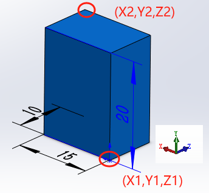
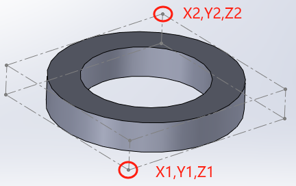

# SW_边界框

完整代码

```C#
public static string Get_BoundingSize_value(SldWorks swApp)
{
    ModelDoc2 swDoc = swApp.ActiveDoc;

    // 获取零件或装配体边界框信息
    PartDoc Part = (PartDoc)swDoc;
    double[] Corners = Part.GetPartBox(true); 

    //计算边界框的长度、宽度和高度
    object Length = (Corners[3] - Corners[0]) * ConvFactor;// X轴
    object Width = (Corners[5] - Corners[2]) * ConvFactor; // Y轴
    object Height = (Corners[4] - Corners[1]) * ConvFactor;// Z轴

    string s = Length + "×" + Width + "×" + Height; 
}
```


## 获得边界框

GetPartBox()方法返回值将是六个数值的Corners数组

```C#
ModelDoc2 swDoc = swApp.ActiveDoc;
// 获取零件或装配体边界框信息
PartDoc Part = (PartDoc)swDoc;
double[] Corners = Part.GetPartBox(true); 
```

返回值在模型中的表现：

即：Corners={X1,Y1,Z1,X2,Y2,Z2}={0，0，0，0.015，0.02，0.01}



如果是不规则模型：则会按【参考几何体-边界框】获得



## 计算长宽高

利用边界框的数据，进行数值的加减，或者线段的长度（也就是边界框的长宽高尺寸）

```C#
//计算边界框的长度、宽度和高度
object Length = (Corners[3] - Corners[0]) * ConvFactor;// X轴
object Width = (Corners[5] - Corners[2]) * ConvFactor; // Y轴
object Height = (Corners[4] - Corners[1]) * ConvFactor;// Z轴
```


