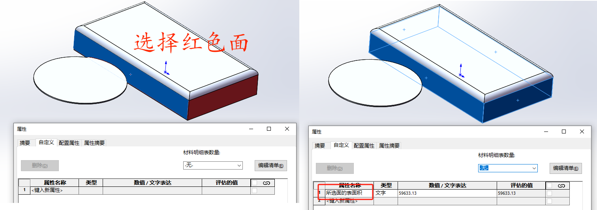

# Sw_选择同颜色面

当我们需要对相同颜色或外观面进行统计处理时，可用考虑使用如下方法。

## 代码

//主函数

```C#
public static void Function(SldWorks swApp)
{
    //获得所选面的颜色信息
    if (swFace != null) GetFaceColor(swFace);
    else { Console.WriteLine("swFace没有获得对象"); return; }
    //比较颜色获得相同颜色的面
    swModel.EditRebuild3();
    SelectFaces(swPrt);
    //测量
    Measure swMeasure = (Measure)swModel.Extension.CreateMeasure();
    //写入属性
    string porp_name = "所选面的表面积";
    string porp_value = (swMeasure.TotalArea * 1000000).ToString();
    swModel.Extension.CustomPropertyManager[""].Add3(porp_name, (int)swCustomInfoType_e.swCustomInfoText, porp_value, (int)swCustomPropertyAddOption_e.swCustomPropertyDeleteAndAdd);
     
}

```

//获得所选面的颜色信息

```C#
private static void GetbFaceColor(Face2 swFace)//获得所选面的颜色信息
{
    double[] Values = (double[])swFace.MaterialPropertyValues;
	target_R = Values[0] * 255;	target_G = Values[1] * 255;	target_B = Values[2] * 255;
}
```

//获得所选面的颜色信息

```C#
private static void GetbFaceColor(Face2 swFace)//获得所选面的颜色信息
{
    object[] Faces = (object[])swBody.GetFaces();
    for (int j = 0; j < Faces.Length; j++)
    {
        Face swFace = (Face)Faces[j];
        Values = (double[])swFace.MaterialPropertyValues;
    	R = Values[0] * 255;G = Values[1] * 255;B = Values[2] * 255;       
        if (R == target_R && G == target_G && B == target_B)
        {
            swSelMgr.AddSelectionListObject(swFace,swSelMgr.CreateSelectData());
        }
    }
}
```


## 使用




# Q&A

目前只支持【面】对象的操作，这意味着如果你外观是添加在拉伸切除等【特征】对象上时，获取是无效的

```
外观层分为：顺序也决定那种外观在最外层（可见）
	|——装配体
	|——零件
	|——面
	|——曲面
	|——实体
	|——特征
```


