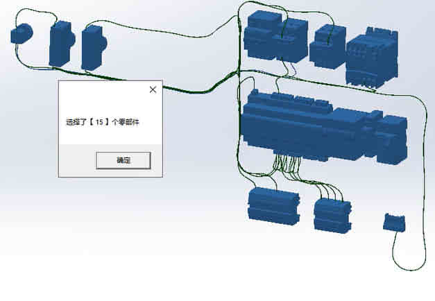

# Sw\_统计选择数量（V1.0）

实现在装配体选择部分零件进行数量的统计功能

## 目的

为什么会有这个需求呢：是因为有小伙伴需要统计一部分类型零件的数量

（如果是导出材料明细表然后再 Excel 统计就比较麻烦）



## 代码

```C#
/// \<summary\>
/// 统计零件
/// \</summary\>
public static void GetSelectedMember()
{
if (swDoc != null)
{
SelectionMgr swSelMgr = swDoc.SelectionManager; //选择管理器对象
//获取 SOLIDWORKS 主框架。
Frame swFrame = swApp.Frame();
//在状态栏左侧的主状态栏区域中显示文本字符串。
//GetSelectedObjectCount2(-1)方法为获取被选择对象的数量,-1 表示所有对象
swFrame.SetStatusBarText(\"选择了 \" +
swSelMgr.GetSelectedObjectCount2(-1) + \" 个零部件\");
}
else
{
MessageBox.Show(\"请打开装配体\");
}
}
```

## 使用

1、【右键工具栏-自定义-宏-自定义宏命令】拖放到工具栏，并添加宏程序文件。（具体操作可参考往期内容《Sw_CSharp 宏程序-A》）

2、打开装配体并选择零件，我这里是选择了电箱的标准件，并对标准件数量进行统计

3、点击该命令，弹窗显示零件数量。
