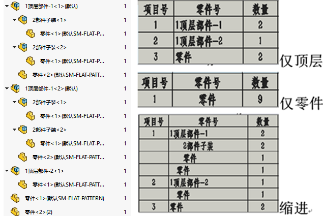
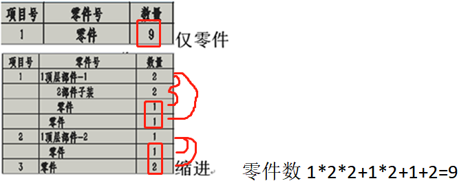
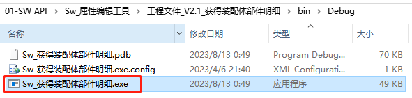
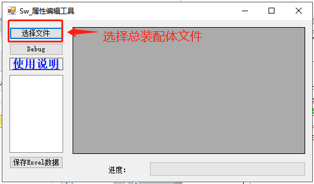
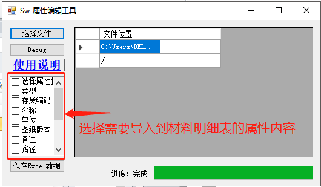
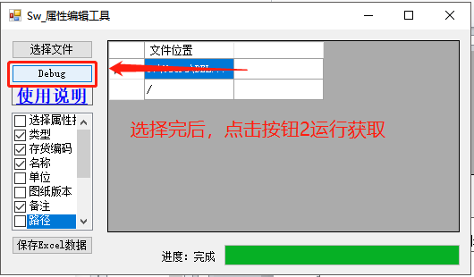
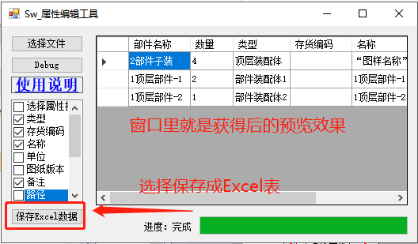
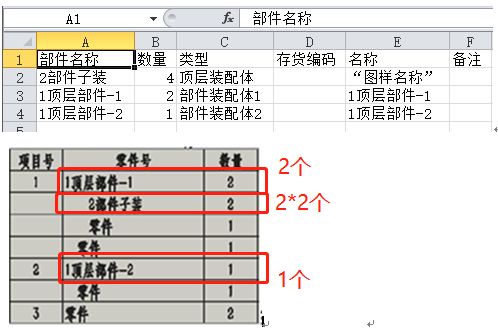

# Sw 获得装配体部件明细

版本说明（V1.0）


## 需求说明：

SOLIDWORKS 的材料明细表截至目前是有"仅顶层"、"仅零件"、"缩进"三种类型。其效果简介如下：



通常我们常用的是"仅零件"类型的材料明细表，用以统计零件单位的清单目录。但是，如果需要统计总装的部件汇总时就比较麻烦。

需要注意的是"缩进"是按层级给部件按成套的数量统计的，可以留意上图"2 部件子装"，我们从实际的数量中发现总数是 4，但是在缩进的材料明细表里数量是 2\*2（由上一级的数量按乘法计算得）。再举个例子："仅零件"下零件的总数是 9，但缩进的数据从单行看的话就是 5，明显不对。需要乘以上一级的套数才是实际数量。



因此，我们希望寻求一种解决方法：将"仅装配体（部件）"做为类型的材料明细表的统计方法。

## 方法

在该方法中，我们利用对总装里部件的"循环查找"+"部件判断"的方式筛选出仅为子装配体部分。

```C#
 private void GetAllcomponents(ISwDMDocument swDoc, List<string> strList)//Debug
        {
            ISwDMConfigurationMgr2 configmgr_asm = (ISwDMConfigurationMgr2)swDoc.ConfigurationManager;
            ISwDMConfiguration2 config_asm = (ISwDMConfiguration2)configmgr_asm.GetConfigurationByName(configmgr_asm.GetActiveConfigurationName()); ;
            object[] objs = config_asm.GetComponents();

            foreach (var item in objs)
            {
                SwDMComponent10 component = (SwDMComponent10)item;
                if ((int)component.DocumentType == 2&& !(component.IsSuppressed()))
                {//判断是类型2：装配体
                    GetAllcomponents(component.GetDocument(true, out _), strList);//递归
                    strList.Add(component.Name);

                }
            }
        }
```

通过用 List\<string\>统计和去重复的部件对象名，这一步可以获得总装里各部件的数量情况。

```C#
List<string> strList = new List<string>();
var dic = strList.GroupBy(x => x).ToDictionary(g => g.Key, g => g.Count());
int Row_i2 = 0; foreach (KeyValuePair<string, int> temp in dic)
    {
        Console.WriteLine("{0},{1}", temp.Key, temp.Value);
    }
```

材料明细表内容用属性方法获得，其功能类似之前的"Sw\_属性编辑工具"

## 使用

1、打开工具程序



2、选择总装配体文件。注意文件是需要可读（非只读）的状态，并且不要在 SW 软件打开（被占用）。



3、勾选需要显示在材料明细表里的属性内容



4、选完属性后，点击按钮 2 获取内容



5、保存 Excel 表



6、以下是 Excel 软件打开的内容，我们可以对比文章开头的清单数量。可以发现数量正确，"仅装配体（部件）"的材料明细表导出效果完成。


