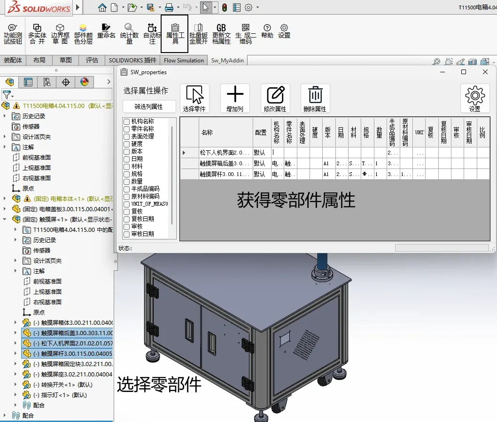
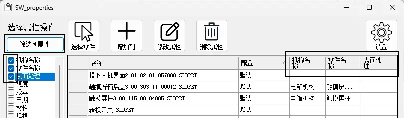
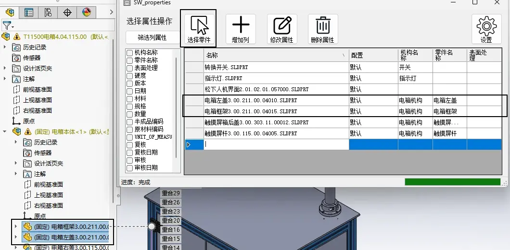
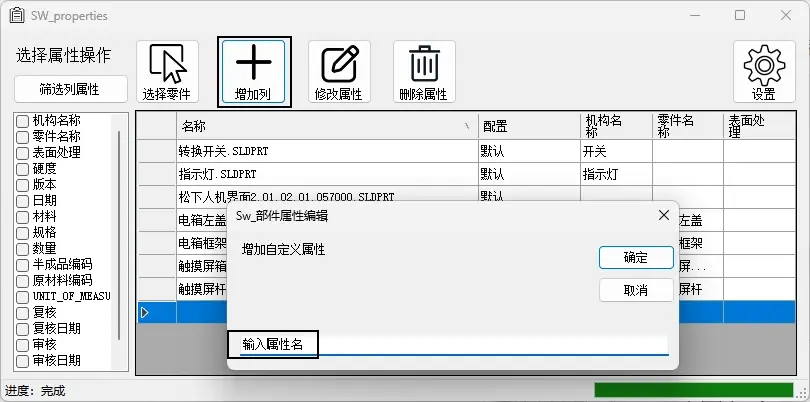
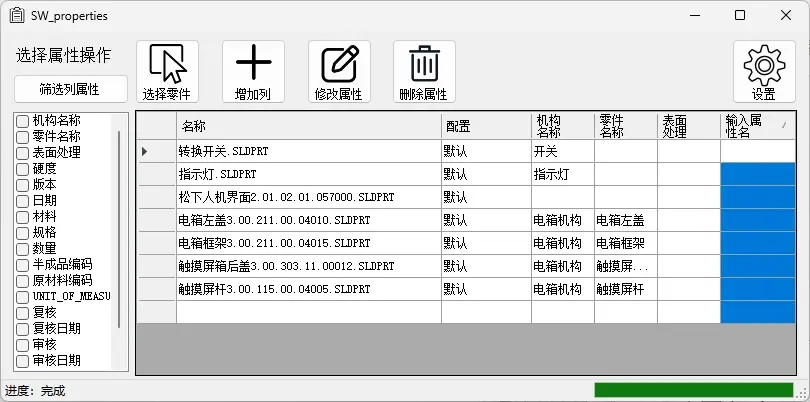

# Sw_零件属性编辑


```C# 
 public static void CopyCustProps()
        {
            object vPropNames = null;
            object vPropTypes = null;
            object vPropValues = null;

            swCustPropMgr.GetAll(ref vPropNames, ref vPropTypes, ref vPropValues);//获得零件的属性
            

            string[] vCompCustPropNames = (string[])vPropNames;
            int[] vCompCustPropTypes = (int[])vPropTypes;
            string[] vCompCustPropValues = (string[])vPropValues;

            for (int i = 0; i < vCompCustPropNames.Length; i++)
            {
                swCustPropMgr.Delete2(vCompCustPropNames[i]);
            }
            for (int i = 0; i < vCompCustPropNames.Length; i++)
            {
                swCustPropMgr.Add2(vCompCustPropNames[i], vCompCustPropTypes[i], vCompCustPropValues[i]);
            }
        }
```


## 获得属性对象

swCustPropMgr

```
ModelDoc2 swModel= swApp.ActiveDoc;
CustomPropertyManager swCustPropMgr = swModel.Extension.CustomPropertyManager[""];
```


## 获得属性

```C#
object vPropNames = null;
object vPropTypes = null;
object vPropValues = null;

swCustPropMgr.GetAll(ref vPropNames, ref vPropTypes, ref vPropValues);//获得零件的属性

string[] vCompCustPropNames = (string[])vPropNames;
int[] vCompCustPropTypes = (int[])vPropTypes;
string[] vCompCustPropValues = (string[])vPropValues;
```


## 删除属性


```C#
swCustPropMgr.Delete2(vCompCustPropNames[i]);
```


## 添加属性

```C#
swCustPropMgr.Add2(vCompCustPropNames[i], vCompCustPropTypes[i], vCompCustPropValues[i]);
```


# Sw_部件属性编辑

当我们以还原的方式打开装配体时，其零部件也是有加载到程序内存里来的。按理是可以不用打开零部件再编辑零件的属性的。

通过object[] vComponents = swAssy.GetComponents(false);获得零部件集合，

再遍历集合里的零部件，用 swCustPropMgr = swCompModel.Extension.CustomPropertyManager[""];去对属性进行编辑。

## 代码

```C#
public static void Prop()
        {            
            // 获取当前活动的文档
            AssemblyDoc swAssy = (AssemblyDoc)swApp.ActiveDoc; 
			CustomPropertyManager swCustPropMgr;
            // 写入属性之前，将装配体设定轻化到还原
            swAssy.ResolveAllLightWeightComponents(true);
            // 获取零部件，true仅获取顶层组件，false是全部
            object[] vComponents = swAssy.GetComponents(false);
            foreach (object SingleComponent in vComponents)
            {
                // 获取零部件的自定义属性
                Component2 swComponent = (Component2)SingleComponent; 
                ModelDoc2 swCompModel = swComponent.GetModelDoc2();
                if (swCompModel == null)
                {
                    continue;
                }
                if (swCompModel.GetType() == (int)swDocumentTypes_e.swDocPART)
                {
                    swCustPropMgr = swCompModel.Extension.CustomPropertyManager[""];
                    swCustPropMgr.Add3("Length", (int)swCustomInfoType_e.swCustomInfoYesOrNo, "X", (int)swCustomPropertyAddOption_e.swCustomPropertyDeleteAndAdd);
                }
                else if (swCompModel.GetType() == (int)swDocumentTypes_e.swDocASSEMBLY)
                {
                    swCustPropMgr = swCompModel.Extension.CustomPropertyManager[""];
                    swCustPropMgr.Add3("Length", (int)swCustomInfoType_e.swCustomInfoText, "X", (int)swCustomPropertyAddOption_e.swCustomPropertyDeleteAndAdd);
                }
            }
        }
```

# 功能说明

属性工具将用于获得所选零部件的属性内容，并显示在程序表格内。如图1



## **筛选属性**

有时我们零部件的属性会比较多，我们只想查看指定的部分，那可以选中左侧属性列表内容，并【筛选属性】即可



## **选择零件**

如果有需要添加进程序表格新零部件，可以再次选中零部件后，操作【选择零件】



## **增加列**

如果有需要在零部件内新增属性，则可以直接【添加列】，增加属性内容



增加后，表格会多出一列



## **修改属性**

当你修改好表格内容后，可以运行【修改属性】，这里会按表格内容对零部件进行属性修改更新。

## **删除属性**

当你需要删除属性，可以选择指定的属性后，运行【删除属性】即可


