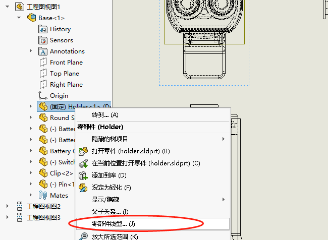
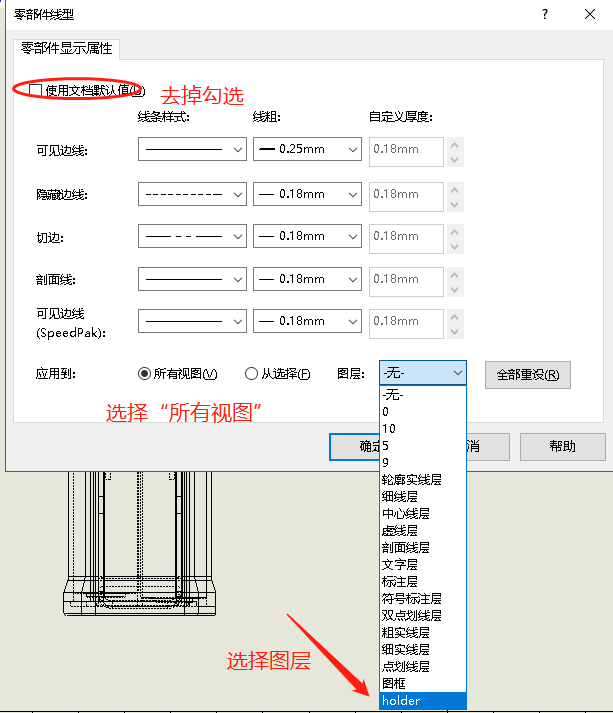
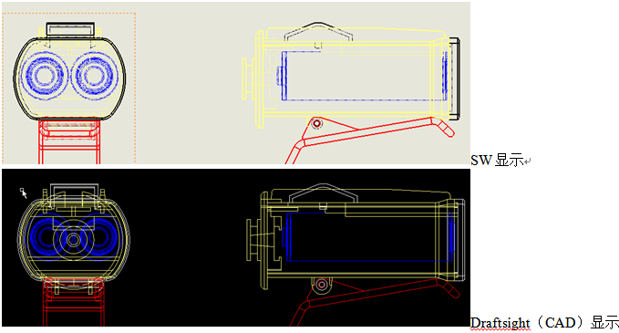

# Sw_部件颜色分层

改变工程图零件颜色方法，用以 CAD 查看和分块做准备。

（说明：SW 工程图理论上是不需要分块的，因为 SW 的工程图本身就是已零件为单元的集合。使用可以通过另一种方式制作 CAD 块。）

## 手动操作

1、新建图层，名称可以按零件名命名，设置颜色，样式默认即可（遮挡部分会自动虚线显示）。

2、右键零部件------选择"零部件线型"。

3、去掉勾选"使用文档默认值"，应用到"所有视图"并选择相应图层即可。

4、完成效果，之后导出到 CAD 中处理即可。

## 代码

## 使用
