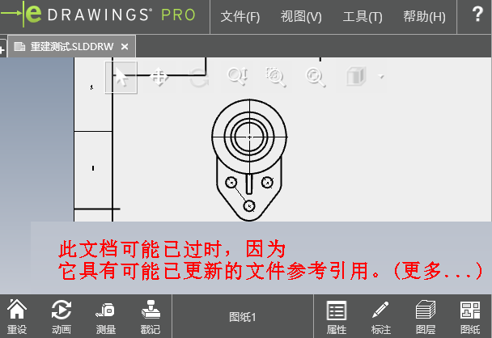
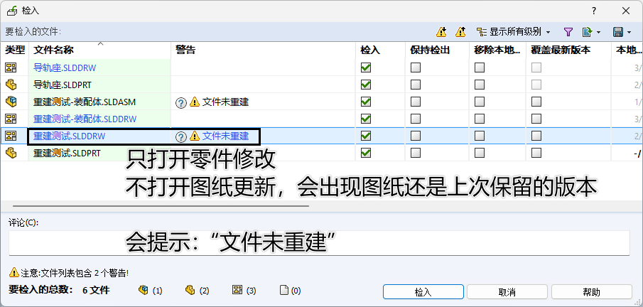

# Sw_重建工程图

一般情况下，但只打开了零件修改保存后，因为工程图是没有打开进行更新并保存新零件版本。因此工程图会出现还是上次保存版本的信息，这种一些看图软件和管理系统里会有明确体现：

eDrawing看图器提示：



PDM系统提示：



<!-- more -->

## 使用

打开装配体，运行【Sw_重建工程图】程序。程序会在所有零部件的工程图进行遍历检查。

判断需要保存的工程图，并进行保存更新。

## 代码

```c#
//打开工程图
ModelDoc2 drawing_com = swApp.OpenDoc6(drawing_path, (int)swDocumentTypes_e.swDocDRAWING, (int)swOpenDocOptions_e.swOpenDocOptions_Silent, "", errors, warnings);
if (drawing_com == null) { continue; }

//判断工程图是否需要保存
if (drawing_com.GetSaveFlag())
{
    drawing_com.ForceRebuild3(true);
    drawing_com.Save2(true);
}
swApp.CloseDoc(drawing_path);
```

