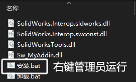
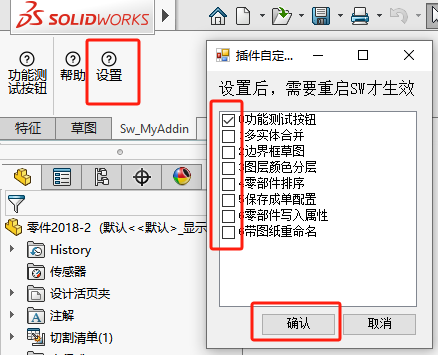
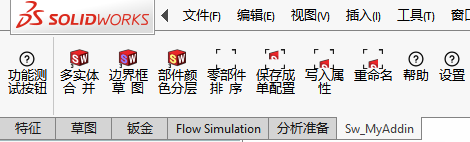

# SW_Addin_介绍

本文介绍插件的功能

## 下载

Q群文件下载：274959842

Gitee托管平台：[下载](https://gitee.com/littleboy97/sw_myaddin/releases/download/A1.0.1/Sw_MyAddin.zip)

GIthub托管平台：[下载](https://gitee.com/littleboy97/sw_myaddin/releases/download/A1.0.1/Sw_MyAddin.zip)

## 安装

下载好插件程序后，打开压缩包，用管理员运行“安装.Bat”文件。这一步会把插件信息安装到电脑注册表内，这样打开SW就能启用该插件了。



```
set path=%~d0
cd %path%
cd /d %~dp0

C:\Windows\Microsoft.NET\Framework64\v4.0.30319\RegAsm.exe Sw_MyAddin.dll /codebase
pause
```


## 设置

首次使用时，插件的界面是只有3个命令，我们需要通过【设置】，来开启我们需要的命令。勾选后确认设置。然后重启SW即可。



# 功能

插件界面



# 功能-零件

## 多实体合并

对于一些多实体的零部件，特别是标准件。我们可能不需要花里胡哨的的多实体，就可以进行合并操作。

## 移除零件特征

异常零件特征，并作成实体特征处理。注意：这个操作会**移除参数**，是不可逆的

## 边界框草图

对当前文件的外形生成包围的【边界框】草图。这个草图是可以被选中的。

# 功能-装配体

## 零部件排序

对设计树里的零部件名称进行排序

## 写入属性

对零部件写入图号分离的“方程式”和“属性”。

## 保存单配置

将多配置的总装配体。那对应配置进行另存（零部件也按当前配置另存成单配置）。


# 功能-工程图

## 部件颜色分层

 源自于CAD颜色分层的想法。这个功能是将装配体的顶层零部件进行分层，然后设置颜色区分，这有利于导出DWG/DXF格式时，自带部件分层的颜色效果。

## 重命名

实现重命名零部件时，工程图也随之同步重命名。这样可以保证从零部件界面【打开工程图】的关联性
