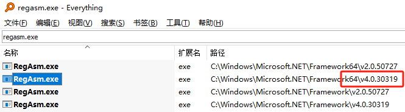

# 插件_注册安装

.net的dll都是要注册才能使用，注册的话我们要用到regasm.exe这个文件。我们要用到的是64位的，v4.0的



任意文件夹目录下，新建两个bat文件，用来执行regasm程序的注册操作。

## 安装

```c#
set path=%~d0
cd %path%
cd /d %~dp0

C:\Windows\Microsoft.NET\Framework64\v4.0.30319\RegAsm.exe <插件名称>.dll /codebase
pause
```

## 卸载

```
set path=%~d0
cd %path%
cd /d %~dp0

C:\Windows\Microsoft.NET\Framework64\v4.0.30319\RegAsm.exe <插件名称>.dll /u
pauses
```


# 插件_程序安装

这一种情况感觉比较高端一点，可以生成msi格式的安装包。

这种方式我经常使用的是Inno Setup 5这个软件，来制作安装包。它的功能比较强大，大家可以自行学习。

它的好处就是当前有很多文件需要包装的时候，压缩比还是不错的。

能够生成快捷方式，插件注册，文件释放，程序菜单的生成，自动生成删除程序的信息，可以在windows的程序列表中显示。

可以设置多种语言文件，还有安装时显示各种许可信息

