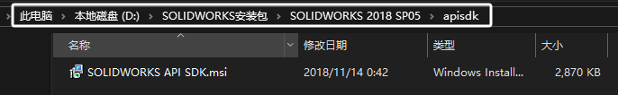
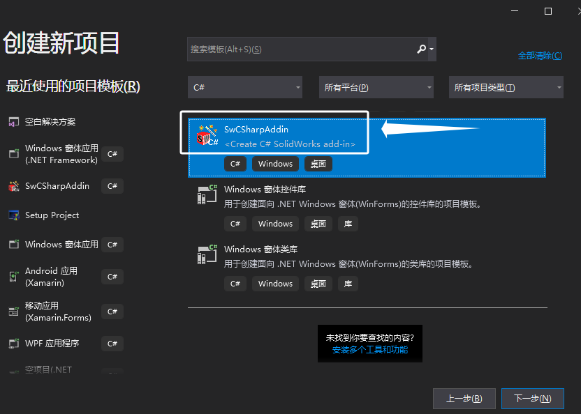
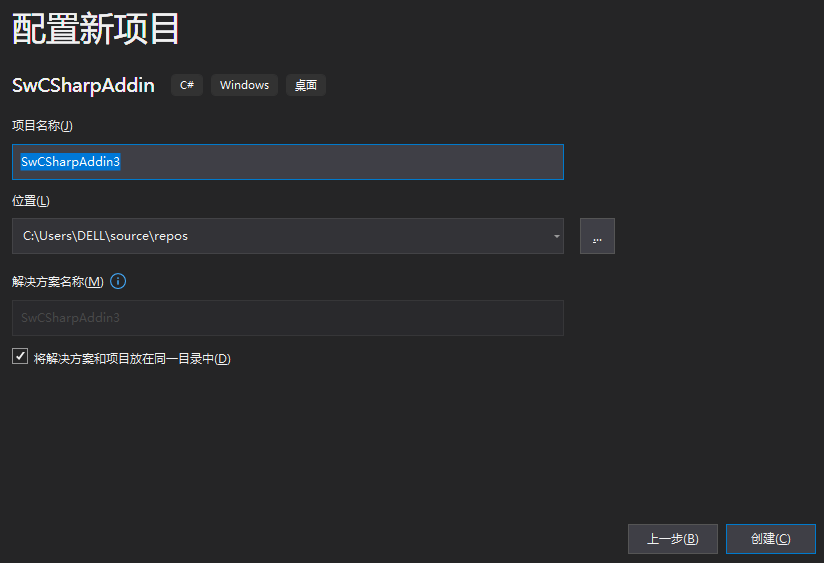
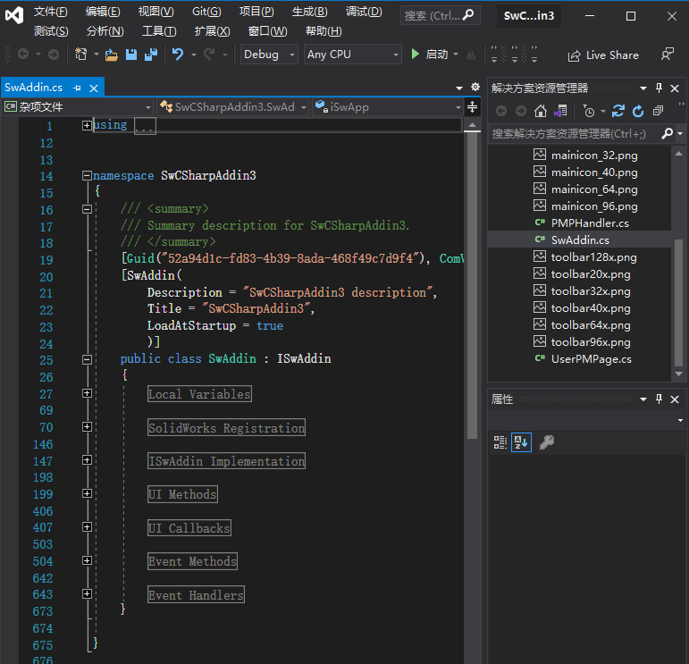
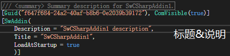
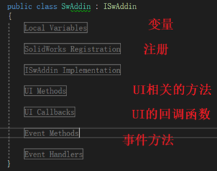

# 官方插件SDK使用

SOLIDWORKS 提供一种官方的插件方案，你需要先安装SOLIDWORKS API SDK来获得“swcsharpaddin”插件模板：



<!--morn-->

## 安装：

1、打开 Microsoft Visual Studio .NET。单击“新建>项目>文件”。

2、在“新建项目”对话框的左侧面板中，选择：
Visual C#，滚动到中间面板的末尾，然后选择“SwCSharpaddin 加载项模板”。
Visual Basic，滚动到中间面板的末尾，然后 选择“SwVBAddin 加载项模板”。



3、修改“名称”、“位置”、“解决方案”和“解决方案名称”字段。单击“确定”。



4、打开“解决方案资源管理器”。双击 Swaddin.* 将其打开。



## 说明：

Guid：为插件生成后注册到注册表的项，由系统自动生成。
Description：为插件的描述信息
Title：为插件的名称。





```C#
//为插件生成后注册到注册表的项，由系统自动生成
[Guid("F8117953-FF24-40B7-BD35-DA0637C5842C"), ComVisible(true)]
//Description：为插件的描述信息；Title：为插件的名称。
[SwAddin(Description = "插件说明", Title = "插件名", LoadAtStartup = true)]
```

# 代码内容

插件的大致内容：


## 工具栏定义

ICommandManager Interface Members（工具栏管理器对象）

ICommandGroup Interface Members（工具栏）


### 创建工具栏

CreateCommandGroup2 Method (ICommandManager)
在命令管理器中创建新的命令组。

### 工具栏分栏

CommandTabs Method (ICommandManager)
获取指定文档类型的所有外接程序命令管理器选项卡。

### 添加命令

AddCommandItem2 Method (ICommandGroup)
将组合菜单项和工具栏项添加到命令组。

### 下拉框

CreateFlyoutGroup2 Method (ICommandManager)
在命令管理器和上下文相关菜单中创建新的浮出控件。

## 属性框定义

xxx
AddItemToThirdPartyPopupMenu2 Method (ISldWorks)
将菜单项添加到 SOLIDWORKS 附加模块中的弹出（快捷方式）菜单中。


# Q&A

## SolidWorksTools 引用

SOLIDWORKS API SDK在安装位置<install_dir>中安装了 SolidWorksTools.dll。

这模板将此 DLL 添加到外接程序项目的引用列表中。这 DLL 必须与外接程序应用程序一起重新分发。

目前，此 DLL 包含 SOLIDWORKS 位图处理程序类、BitmapHandler、 它基于 SOLIDWORKS CommandManager。使用 Microsoft Visual Studio .NET Object Browser 或 Intellisense 查看其成员。

## 手动添加C#模板：

把swcsharpaddin.zip放到对应的C#模板目录下即可
