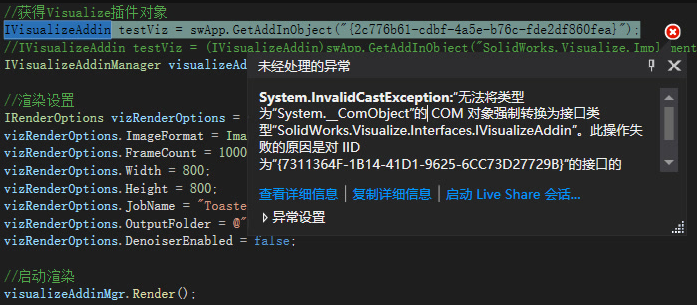

# SW_Addin_Visualize

```c#
 class SW_Visualize
    {
        //IVisualizeAddinManager类型转换失败，不知啥问题。。。
        public static void Render(SldWorks swApp)//导出PDF
        {
            //获得Visualize插件对象
            IVisualizeAddin testViz = swApp.GetAddInObject("{2c776b61-cdbf-4a5e-b76c-fde2df860fea}"); 
            //IVisualizeAddin testViz = (IVisualizeAddin)swApp.GetAddInObject("SolidWorks.Visualize.Implementation.VisualizeAddin.18");
            IVisualizeAddinManager visualizeAddinMgr = testViz.GetAddinManager();

            //渲染设置
            IRenderOptions vizRenderOptions = visualizeAddinMgr.RenderOptions;
            vizRenderOptions.ImageFormat = ImageFormat_e.JPEG;
            vizRenderOptions.FrameCount = 1000;
            vizRenderOptions.Width = 800;
            vizRenderOptions.Height = 800;
            vizRenderOptions.JobName = "Toaster";
            vizRenderOptions.OutputFolder = @"E:\SOLIDWORKS Visualize Content\Images";
            vizRenderOptions.DenoiserEnabled = false;

            //启动渲染
            visualizeAddinMgr.Render();
        }

    }
```


## 效果


# Q&A

## 运行问题

在运行时，发现如下问题：

在SWAddin插件环境下运行却正常，不清楚原因，问题待定。



## Visualize版本要求

是否能标准版就是能使用，还是需要专业版的许可，

单从


